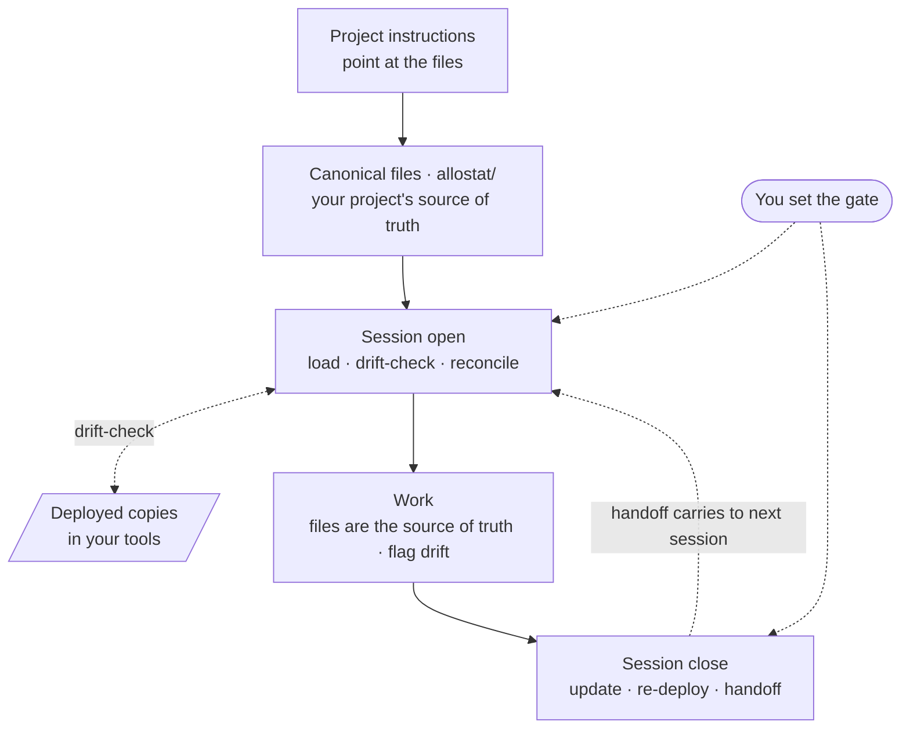

# Allostat

As your project grows, Allostat keeps the context Claude works from sharp, consistent, and current.

## What it is

Your project's context — purpose, conventions, decisions, environment, the tools Claude can use — lives in canonical files you own. Four things keep it from rotting as the project grows:

- **One source of truth.** Not scattered across settings.
- **Drift-check.** At session start, each canonical file is compared to the copy deployed wherever you're working (a settings field, a rules file); any gap is reconciled before it bites.
- **You hold the gate.** Automate the mechanical, gate the meaningful — the routine runs itself; the judgment calls wait for you. AI's speed is its risk as much as its draw: unchecked, it just ships the debt faster. The gate is the check.
- **It compounds.** Upkeep is captured, not redone — the setup improves with use instead of resetting each conversation.

A living configuration: decisions and patterns get captured, principles get revised when they stop fitting, layers extend as the work changes. You can only revise what you can see and edit — hence files you own.

**Drift in practice.** You change a convention in canonical `project-instructions.md`; the copy pasted into your project settings still has the old one. Next session Claude follows the stale copy. The drift-check catches the mismatch up front; you reconcile.

## What it's fighting against

- **Sprawl / bloat** → *sharp.* Context balloons, half-duplicated; you can't tell what's load-bearing.
- **Fragmentation** → *consistent.* Different config per surface — four versions of you.
- **Drift / staleness** → *current.* Canonical ≠ deployed; an old line quietly steers the model wrong.
- **Cold starts / re-explanation** — every conversation starts blank; you re-explain yourself.
- **Lost corrections** — you fix something; next session the mistake's back.
- **Stale principles** — corrections pile up without anyone asking if the principle still fits.
- **Rigidity** — the config's locked to how you started, not how you work now.

## What's in the folder

Your project's context lives in a handful of files you own, in an `allostat/` folder — each with one job:

- **`project-instructions.md`** — what this project is: purpose, conventions, domain notes.
- **`plan.md`** — done / current / next. Read it to resume.
- **`decisions.md`** — locked choices and the reasoning, marked when they change.
- **`observations.md`** — patterns and corrections worth keeping.
- **`vision.md`** — where the project's headed at the longer horizon, and why. Optional; leave it thin until there's direction beyond the plan.
- **`workflow.md`** — the session routines (open, drift-check, close, handoff), including first-run setup.
- **`knowledge/`** — your environment and project references, pointed at rather than copied in.

Your project's instructions point Claude at these files at the start of each session.

*(There's a fuller model behind why these files exist and how they compose across surfaces — the design reasoning lives in [`concepts.md`](./concepts.md). You don't need it to use Allostat.)*

### Optional: let Claude recognize the system

One line for your Custom Instructions:

> Some of my projects use a layered context system: canonical files (an `allostat/` folder, with a `CLAUDE.md` listing what to load) that are the source of truth. When a project has them: load them, treat them as authoritative, follow its `workflow.md` to keep them in sync (drift-check at start, update at close), and flag anything stale rather than following it. If a project doesn't have them, ignore this.

A pointer, not a setup. The routine lives in each project's `workflow.md`.

## How a session goes



*Drift-check: canonical files vs. the copies deployed in your surfaces. Gate: what needs your sign-off before anything changes.*

1. **Open** — drift-check, reconcile.
2. **Work.**
3. **Close** — update files, re-deploy, write handoff. You approve each step.

Design reasoning (why files, why the gate, why principles can change): [`concepts.md`](./concepts.md).

## Quick start

**What you need before you start:** a project on local storage — a folder or repo on your machine where an `allostat/` directory can live — and an AI surface that can read and write files in it: **Claude Code, Cursor, or Claude Desktop with file access**. Allostat keeps your project's context in real files, so file access is the one prerequisite. *(A lighter web / no-files path may come later; for now Allostat assumes local files.)*

Language-agnostic.

1. **Add the `allostat/` files.** They ship with working defaults and guidance inside — you fill blanks, not start from one. `allostat init` will place them for you (planned); until then, copy `templates/project-boilerplate/` from the repo:

   ```
   your-project/
     allostat/
       project-instructions.md   # what this project is, its conventions
       plan.md                   # done / current / next
       decisions.md              # locked choices + why
       observations.md           # patterns worth keeping
       workflow.md               # the session routines (incl. first-run setup)
       knowledge/                # environment and references
       skills/                   # documented capabilities (optional)
     CLAUDE.md                   # optional: the pointer, if you use Claude Code
   ```

2. **Tell your project to use the files.** Paste a short instruction block into your project's instructions — the **Project Instructions** field (e.g. in Claude Desktop) — pointing at the `allostat/` folder and telling Claude to load and follow the files:

   > This is an Allostat project. The canonical files in its `allostat/` folder — `project-instructions.md`, `workflow.md`, `plan.md`, `decisions.md`, … — are the source of truth. At the start of a session, read them, follow `workflow.md`, treat them as authoritative, and flag anything stale rather than just following it.

   The block is only the pointer and "use these" — the files carry the actual instructions. *(Using Claude Code? A `CLAUDE.md` at the repo root does the same thing via `@`-imports — use that instead if you have it.)*

3. **Let the files take it from there.** On the first session they self-instruct: Claude loads `workflow.md` / `project-instructions.md` and walks you through filling them in — you don't memorize a setup, the files run it.

4. **Confirm it took.** Start a fresh conversation *in the project* and ask where things stand. Claude should open by loading your files and orienting — a drift-check, then current state and next work. If it doesn't, the manifest block isn't in `CLAUDE.md`, or the files aren't where it points.

## Files

| File | Edit? | What |
|---|---|---|
| `allostat/project-instructions.md` | yes | This project: purpose, conventions. Fill in first. |
| `allostat/plan.md` | yes | Done / current / next. Read to resume. |
| `allostat/decisions.md` | yes | Locked choices + reasoning. Mark changes, don't delete. |
| `allostat/observations.md` | yes | Patterns and corrections worth keeping. |
| `allostat/vision.md` | as needed | Where the project's headed + why. Optional; thin until it earns content. |
| `allostat/workflow.md` | rarely | Session routines. Ships as a working default. |
| `allostat/knowledge/` | as needed | Environment and references, pointed at. |
| `allostat/skills/` | as needed | Documented capabilities. Optional. |
| `CLAUDE.md` | rarely | Manifest declaring what loads each session; the drift-check reads it. Your project may already have one — **add Allostat's block, don't overwrite**. |

## Status

Working: templates, drift-check, close/update, handoffs. Planned: scaffolder, cross-surface deploy guides, public repo.

## Feedback

Issues and PRs welcome — templates and docs especially. Your project config stays yours.

## License

MIT.

## Disclaimer

Allostat is a set of files and conventions for managing the context an AI assistant works from. The assistant's responses are generated, non-deterministic, and may be inaccurate or incomplete — they are the assistant's output, not the author's. Verify anything that matters before relying on it. Allostat is for general productivity and configuration purposes and is not legal, financial, medical, safety, or other professional advice. You are responsible for how you use it and for any actions taken on your behalf. Provided "as is", without warranty, under the MIT License.
